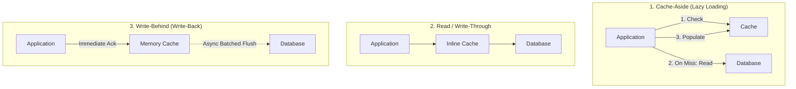

# Caching Topologies & Consistency Patterns

Where a cache sits in the data pipeline determines write latency, consistency guarantees, and durability during infrastructure failures.

---

## 1. Primary Caching Patterns



### Pattern Comparison Matrix

| Pattern | Write Latency | Read Latency | Consistency | Durability Risk |
| :--- | :--- | :--- | :--- | :--- |
| **Cache-Aside** | Normal DB latency | Low on hit; high on miss | Eventual (stale if invalidation fails) | Zero data loss |
| **Write-Through**| Higher (Cache + DB write) | **Lowest** | Strong | Zero data loss |
| **Write-Behind** | **Lowest** (in-memory write) | **Lowest** | Strong (via cache) | **High** (crash before async flush drops writes) |
| **Refresh-Ahead**| Normal | Consistently Low | Eventual | Zero data loss |

---

## 2. The Cache Stampede (Thundering Herd)

When a hot key expires in a high-traffic system (e.g. 10,000 queries/sec):
1. The key vanishes from the cache.
2. Hundreds of concurrent threads simultaneously experience a cache miss.
3. All threads issue identical heavy SQL queries to the database simultaneously.
4. **The database exhausts its connection pool and crashes!**

### Stampede Solutions

#### 1. Distributed Mutex (Single-Flight)
Ensure only one worker queries the database on a miss, while other threads wait for the cache to be repopulated:

```go
// Using Go singleflight pattern:
v, err, _ := requestGroup.Do(key, func() (interface{}, error) {
    return queryDatabase(key)
})
```

#### 2. Probabilistic Early Expiration (XFetch Algorithm)
Instead of waiting for strict expiration ($TTL$), background workers proactively recompute and refresh the value with an exponential probability as expiration approaches:

$$-\beta \cdot \delta \cdot \ln(\text{rand}()) > \text{TTL} - \text{Time}$$

Where $\delta$ is computation time and $\beta$ is aggressiveness ($> 0$). This guarantees hot keys **never experience a cache miss**.
