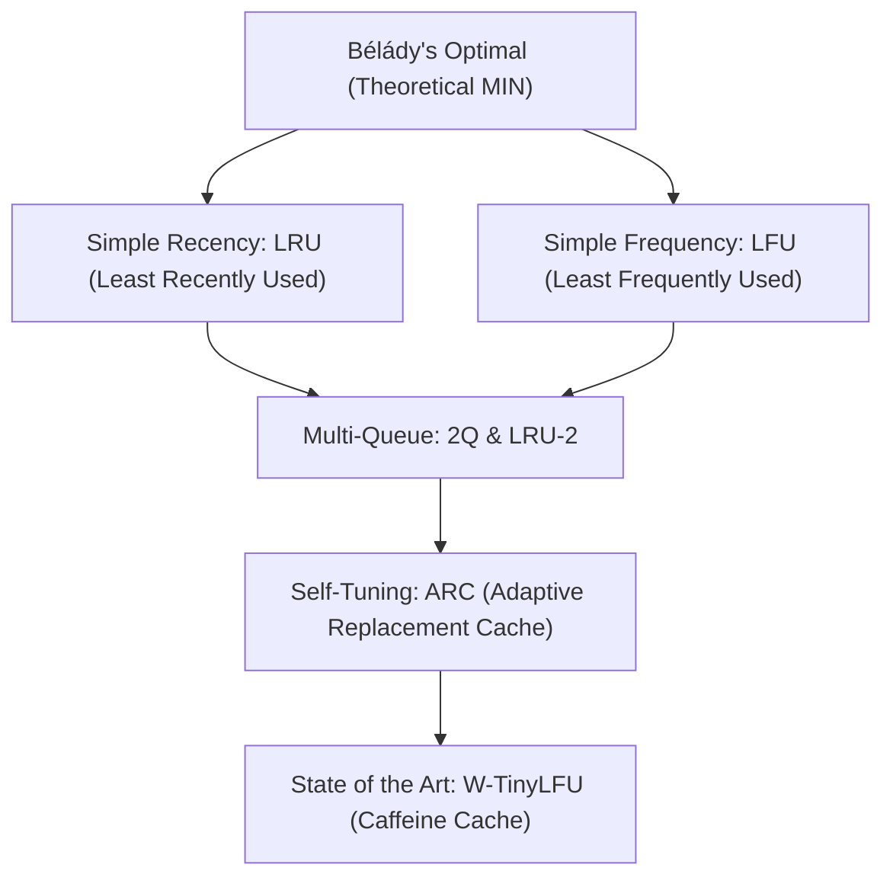
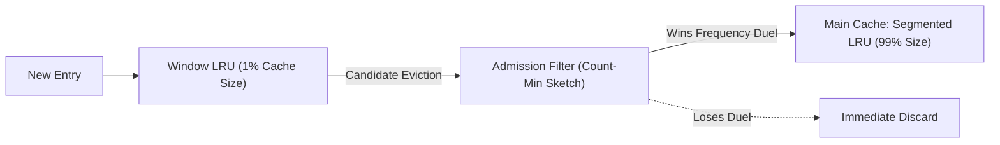

# Cache Eviction Policies (LRU to W-TinyLFU)

Whenever cached working sets exceed physical memory capacity, the cache manager must decide which item to discard to accommodate new entries. The eviction algorithm directly dictates cache hit ratios and database query latencies.

---

## 1. The Eviction Landscape & Scan Pollution

The theoretical ideal is **Bélády’s MIN Algorithm**: evict the item that will not be accessed for the longest time in the future. Because real systems cannot predict the future, algorithms approximate this behavior using **Recency** and **Frequency**.

### The "Table Scan" Vulnerability in Classic LRU
In classic LRU (managed via a hash map and a doubly linked list), a user executing a large batch query or full sequential table scan (`SELECT * FROM logs`) will load millions of one-off pages into memory, **evicting the entire hot working set** from the cache. This is known as **Cache Pollution**.

---

## 2. Evolution of Cache Algorithms

### 1. LRU (Least Recently Used)
- Evicts the item whose last access was furthest in the past.
- **Flaw**: Zero scan resistance. Single-access bursts flush frequently used hot data.

### 2. LFU (Least Frequently Used)
- Evicts the item with the lowest cumulative access count.
- **Flaw**: Frequency starvation. A historical item accessed 10,000 times during a morning flash sale will remain stuck in the cache forever, blocking new relevant keys!

### 3. ARC (Adaptive Replacement Cache - IBM)
Engineered by Megiddo & Modha, ARC maintains two separate LRU lists ($L_1$ for recent entries, $L_2$ for frequent entries) and tracks their eviction history using two **ghost caches** ($B_1, B_2$).
- If a hit occurs in the ghost recency cache ($B_1$), ARC automatically increases the size target of $L_1$.
- If a hit occurs in the ghost frequency cache ($B_2$), ARC automatically expands $L_2$.
- **Result**: ARC continuously self-tunes in real time without requiring manual developer configuration!

---

## 3. W-TinyLFU (The Modern Standard)

Used by high-performance systems like **Caffeine Cache** and adopted across distributed databases, **W-TinyLFU (Window TinyLFU)** achieves near-optimal hit ratios:

1. **Window Cache (1% of RAM)**: Absorbs sudden bursts of new keys and provides full scan resistance.
2. **Frequency Admission Filter**: When an item is pushed out of the Window cache, it is not automatically added to the main cache; it must **win an admission duel** against the victim from the main cache.
3. **Count-Min Sketch**: Uses a space-efficient 4-bit Count-Min Sketch that decays periodically, preventing historical frequency starvation with negligible memory overhead ($\approx 8\text{ bits per entry}$).
