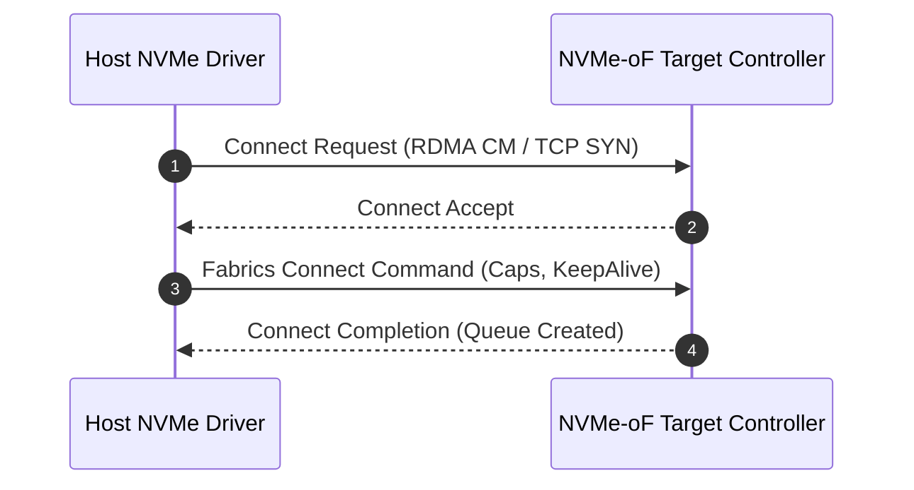

# Contributing to S10RAGE 🛠️

Welcome to **S10RAGE** — the open-source engineering encyclopedia and "MDN for Data Storage Engineering". 

S10RAGE exists to provide rigorous, production-grade technical documentation on everything data storage: from silicon physics, NAND flash, and PCIe NVMe to Linux kernel I/O, distributed consensus (Raft/Paxos), storage engines (LSM/B-Tree), and cloud-native Kubernetes CSI.

We welcome contributions from systems engineers, storage architects, Linux kernel developers, database engineers, SREs, and passionate students.

---

## Quick Navigation
- [How S10RAGE is Structured](#repository-structure)
- [Step-by-Step: Adding a New Storage Module](#step-by-step-adding-a-new-storage-module)
- [Authoring Standards & Formatting](#authoring-standards--formatting)
- [Registering Your Module in Navigation](#registering-your-module-in-navigation)
- [Testing & Validating Locally](#testing--validating-locally)
- [Submitting a Pull Request](#submitting-a-pull-request)
- [Maintainers & Getting Help](#maintainers--getting-help)

---

## Repository Structure

S10RAGE is built on [Docusaurus 3](https://docusaurus.io/) with TypeScript, React, MDX, Mermaid, and KaTeX.

```text
S10RAGE/
├── docs/                        # All technical modules & documentation
│   ├── 01-introduction/         # Course chapters & modules
│   ├── ...
│   ├── 18-capstone-project/
│   ├── storage-networking/      # Topic-based specialized modules
│   ├── physical-layer/
│   ├── os-subsystem/
│   ├── storage-engines/
│   ├── distributed-storage/
│   ├── interactive/             # MDX interactive tools (React components)
│   ├── intro.md                 # Documentation portal home
│   └── contributing.md          # Web version of this contributor guide
├── src/
│   ├── components/              # Reusable React & interactive widgets
│   ├── css/custom.css           # Global design system & theme tokens
│   └── pages/                   # Landing page, maintainers page, etc.
├── static/                      # Logos, icons, SVG diagrams, and images
│   ├── img/
├── sidebars.ts                  # Sidebar navigation tree definition
├── docusaurus.config.ts         # Top navbar, footer, search, and site config
└── package.json
```

---

## Step-by-Step: Adding a New Storage Module

Follow these steps to contribute a new topic or module:

### 1. Fork and Clone the Repository
```bash
git clone https://github.com/sohansinghbhadoria/S10RAGE.git
cd S10RAGE
git checkout -b feat/add-storage-module-name
```

### 2. Install Dependencies
```bash
npm install
```

### 3. Choose the Location for Your Module
- If expanding an existing topic, place your markdown file inside the relevant directory in `docs/`:
  - `docs/physical-layer/` for NAND, controllers, PCIe, DRAM.
  - `docs/os-subsystem/` for VFS, page cache, io_uring, block layer.
  - `docs/storage-engines/` for B-Trees, LSM, WAL, row/columnar stores.
  - `docs/interfaces-and-protocols/` for NVMe, NVMe-oF, RDMA, NFS, iSCSI.
  - `docs/distributed-storage/` for Ceph, MinIO, S3, Raft, Paxos, Erasure Coding.
  - `docs/kubernetes-storage/` for CSI, PVCs, StatefulSets, rook-ceph.
- If creating an entirely new category, create a new folder under `docs/` (e.g. `docs/storage-security/`).

### 4. Create the Markdown / MDX File
Create a new file, for example `docs/storage-security/zero-trust-san.md`:

```markdown
---
id: zero-trust-san
title: "Zero-Trust SAN & Storage Network Encryption"
description: "Architecture and implementation of line-rate IPsec, MACsec, and NVMe-in-band authentication."
sidebar_label: "🛡️ Zero-Trust SAN Security"
---

# Zero-Trust SAN & Storage Network Encryption

Comprehensive technical breakdown of storage fabric security...
```

### 5. Register Your Module in Navigation {#registering-your-module-in-navigation}
To make your module appear in the documentation navigation, open `sidebars.ts` and add its file path relative to `docs/` (without the `.md` extension):

```typescript
// sidebars.ts
{
  type: 'category',
  label: '🛡️ Storage Security & Compliance',
  collapsed: true,
  items: [
    'storage-security/zero-trust-san', // <-- Your module ID
  ],
},
```

### 6. (Optional) Add to the Navbar Dropdown
If your module is part of a major core pillar, you can expose it in the top navigation bar by adding an entry in `docusaurus.config.ts` under `themeConfig.navbar.items`:

```typescript
// docusaurus.config.ts
{
  label: '🛡️ Zero-Trust Storage Security',
  to: '/docs/storage-security/zero-trust-san',
},
```

---

## Authoring Standards & Formatting

S10RAGE maintains an MDN-grade standard of engineering depth. Avoid high-level marketing summaries; dive straight into hardware realities, memory layouts, wire protocols, and kernel syscalls.

### Architecture Diagrams (Mermaid)
Use Mermaid code blocks to illustrate I/O paths, protocol handshakes, and packet frames:

````markdown

````

### Mathematical Models & Physics (KaTeX)
Use LaTeX syntax for latency calculations, bandwidth formulas, or RAID parity equations:

```markdown
$$
\text{Rebuild Time} = \frac{\text{Drive Capacity}}{\text{Sustained Sequential Write Speed} \times (1 - \text{I/O Contention Factor})}
$$
```

### Callouts & Admonitions
Use Docusaurus admonitions to highlight operational warnings, gotchas, or performance tips:

```markdown
:::tip Zero-Copy Hint
Always align user-space buffers to 4KiB page boundaries using `posix_memalign()` when issuing `O_DIRECT` reads to NVMe block devices.
:::

:::caution Data Loss Risk
Disabling the write cache (`hdparm -W 0`) guarantees write persistence on power loss, but reduces random write throughput by up to 80% on consumer SATA SSDs without PLP capacitors.
:::
```

### Reproducible CLI Commands & Benchmarks
Include real-world verification commands (`fio`, `nvme-cli`, `bpftrace`, `sysctl`, `iostat`):

```bash
# Verify NVMe queue depth and host memory buffer (HMB) allocation
sudo nvme id-ctrl /dev/nvme0 -H | grep -E "hmpre|hmmin|sqes|cqes"
```

---

## Testing & Validating Locally

Always verify your changes locally before submitting a PR:

### 1. Start the Development Server
```bash
npm run start
```
Open `http://localhost:3000` to verify your new page renders properly, images and diagrams load, and navigation links work.

### 2. Run the Production Build Check
```bash
npm run build
```
> **Critical**: `npm run build` runs a strict broken-link checker and TypeScript compiler. Your build **must pass with zero errors** and zero broken links.

---

## Submitting a Pull Request

1. **Commit your changes**:
   ```bash
   git add .
   git commit -m "docs: add module on zero-trust SAN storage security"
   ```
2. **Push to your fork**:
   ```bash
   git push origin feat/add-storage-module-name
   ```
3. **Open a PR**:
   - Go to [S10RAGE Pull Requests](https://github.com/sohansinghbhadoria/S10RAGE/pulls).
   - Click **New Pull Request**.
   - Provide a concise summary of the storage topic added, key diagrams, and confirmation that `npm run build` passed.

---

## Maintainers & Getting Help

- **Project Lead**: **Sohan Singh**
  - LinkedIn: [in/amazinglysingh](https://in.linkedin.com/in/amazinglysingh)
  - GitHub: [@sohansinghbhadoria](https://github.com/sohansinghbhadoria)
- **Issues & Discussion**:
  - Open a [GitHub Issue](https://github.com/sohansinghbhadoria/S10RAGE/issues) to propose a topic or discuss architecture before writing.
