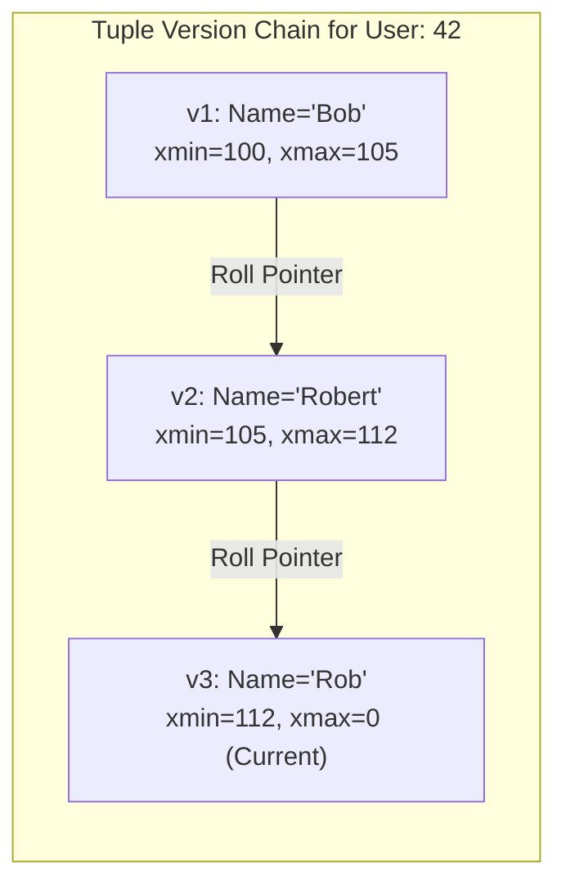
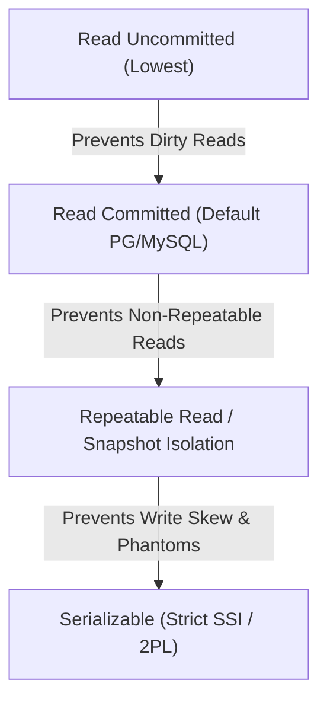

# MVCC & ACID Isolation Levels

In multi-user database engines, concurrency control guarantees the **ACID** properties without turning database transactions into single-threaded bottlenecks. The predominant storage model for modern high-performance databases is **Multi-Version Concurrency Control (MVCC)**.

:::tip The MVCC Golden Axiom
**Readers never block Writers, and Writers never block Readers.**
:::

---

## 1. How MVCC Works at the Storage Layer

Under MVCC, updating a record **does not overwrite it in-place**. Instead, the engine creates a new physical version (tuple) of the row with its own validity timestamps or transaction IDs:

When a transaction executes a `SELECT`, the engine assigns it a **Snapshot (Read View)** containing the current active transaction list. It determines visibility by evaluating tuple headers:
- A transaction $T$ sees version $V$ if $V.\text{xmin}$ was committed before $T$'s snapshot began, **and** $V.\text{xmax}$ is either uncommitted, aborted, or committed after $T$'s snapshot began.

---

## 2. PostgreSQL Heap Tuples vs MySQL InnoDB Undo Logs

The two most popular open-source relational databases implement MVCC with fundamentally different storage designs:

| Dimension | PostgreSQL (Append-in-Heap) | MySQL InnoDB (Rollback Segments) |
| :--- | :--- | :--- |
| **New Version Location** | Appended as a new physical row directly in the data table (**Heap**) | Overwrites the table row in-place; pushes old versions into **Undo Log Segments** |
| **Read Overhead** | Reads scan heap; no pointer traversal needed for old versions | Queries reading older historical snapshots must traverse the **Undo Pointer Chain** |
| **Write Overhead** | Higher (triggers index updates unless HOT - Heap-Only-Tuples is used) | Lower (secondary indexes point to primary clustered key, not physical tuple location) |
| **Garbage Collection** | Background **VACUUM** process scans pages to prune dead tuples | Background **Purge Threads** free undo log segments once old snapshots terminate |

---

## 3. SQL Isolation Levels & Concurrency Anomalies

The ANSI SQL-92 standard defines isolation levels according to three specific anomalies: **Dirty Read**, **Non-Repeatable Read**, and **Phantom Read**. However, modern MVCC systems also suffer from **Write Skew**.

### Isolation Matrix

| Isolation Level | Dirty Read | Non-Repeatable Read | Phantom Read | Write Skew |
| :--- | :--- | :--- | :--- | :--- |
| **Read Uncommitted** | Possible | Possible | Possible | Possible |
| **Read Committed** | **Prevented** | Possible | Possible | Possible |
| **Repeatable Read / Snapshot** | **Prevented** | **Prevented** | **Prevented** (in MVCC) | Possible |
| **Serializable (SSI)** | **Prevented** | **Prevented** | **Prevented** | **Prevented** |

### The Write Skew Anomaly

Under Snapshot Isolation, two concurrent transactions read overlapping rows, make mutually consistent decisions based on that snapshot, but commit modifications to different rows that violate a global business invariant!

> **Classic Example (Doctor On-Call)**:
> Invariant: *At least one doctor must remain on call.* Both Dr. Alice and Dr. Bob read that 2 doctors are on call. Alice takes leave (1 remains). Bob takes leave concurrently (1 remains in his snapshot). Both commit successfully. Result: **Zero doctors on call!**

Only **Serializable Snapshot Isolation (SSI)** (via dependency graph tracking) or explicit locking (`SELECT FOR UPDATE`) prevents write skew.
