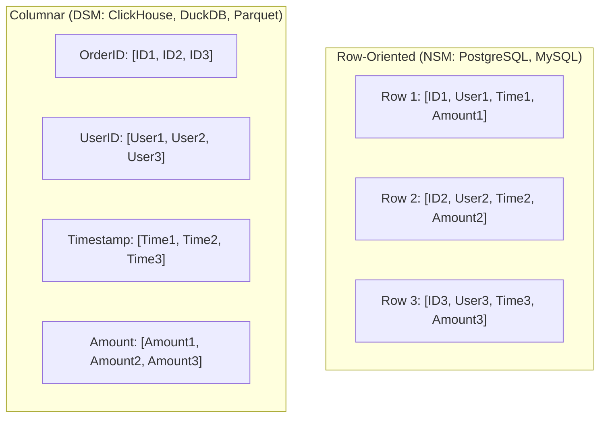

# Row-Oriented vs Columnar Storage

The dichotomy between **Row-Oriented** (OLTP) and **Columnar** (OLAP) storage represents one of the most fundamental design choices in database engineering: how multi-attribute relational tuples are serialized into linear byte arrays.

---

## 1. The Architectural Contrast

Consider a table with four attributes: `OrderID`, `UserID`, `Timestamp`, and `Amount`:

```sql
SELECT avg(Amount) FROM Orders WHERE Timestamp > '2026-01-01';
```



### The I/O Penalty of Row Storage for Analytics
- In a row store, computing `avg(Amount)` requires reading **every single byte of every row** from disk into DRAM, discarding 80-95% of the data in userspace!
- In a column store, the query engine seeks directly to the contiguous `Amount` and `Timestamp` column arrays. `OrderID` and `UserID` arrays are **never touched on disk or bus**, reducing I/O volume by orders of magnitude.

---

## 2. The Hybrid PAX Model (Row Groups)

Pure columnar storage across billions of rows suffers when inserting or deleting rows, as thousands of separate files must be modified.

Modern columnar engines (ClickHouse, Apache Parquet, DuckDB) implement the **PAX (Partition Attributes Across)** layout:
- The table is horizontally partitioned into **Row Groups** (e.g. 64,000 to 1,000,000 rows each).
- Inside each Row Group, data is stored column by column:

```
+-------------------------------------------------------------+
| ROW GROUP 0 (e.g. 100,000 rows)                            |
|  - Column "OrderID":   [Binary array + min/max stats]       |
|  - Column "Timestamp": [RLE compressed array]               |
|  - Column "Amount":    [Gorilla compressed float array]     |
+-------------------------------------------------------------+
| ROW GROUP 1 ...                                             |
+-------------------------------------------------------------+
```

---

## 3. Columnar Compression Primitives

Because values within the same column belong to the exact same datatype and often repeat or trend monotonically, columnar data compresses drastically better than row data (up to **$10\times - 20\times$** reduction):

1. **Run-Length Encoding (RLE)**:
   Replaces repeated contiguous values with `(value, count)` pairs:
   `["US", "US", "US", "US", "FR"]` $\to$ `[("US", 4), ("FR", 1)]`.
2. **Dictionary Encoding**:
   Substitutes high-entropy strings with compact integers:
   `["Pending", "Completed", "Pending"]` $\to$ `Dict: {0: "Pending", 1: "Completed"}`, `Data: [0, 1, 0]`.
3. **Bit-Packing & Frame-of-Reference (FoR)**:
   Stores values relative to a local minimum:
   `[1002, 1005, 1001]` with $\min = 1000$ becomes `[2, 5, 1]`, fitting into 3-bit words instead of 64-bit integers.
4. **Gorilla Compression (Facebook)**:
   XOR-based delta floating-point compression specifically optimized for time-series metrics.

---

## 4. Vectorized SIMD Execution

Because column values reside contiguously in memory, modern database execution kernels (DuckDB, ClickHouse) utilize CPU **SIMD (Single Instruction, Multiple Data)** vector registers (AVX-512 / ARM Neon):

```c
// Adding 8 double-precision floats in a single CPU instruction:
__m512d a = _mm512_load_pd(&amounts[i]);
__m512d b = _mm512_load_pd(&tax[i]);
__m512d sum = _mm512_add_pd(a, b);
```

This delivers query evaluation throughput of **billions of rows per second per CPU core**.
