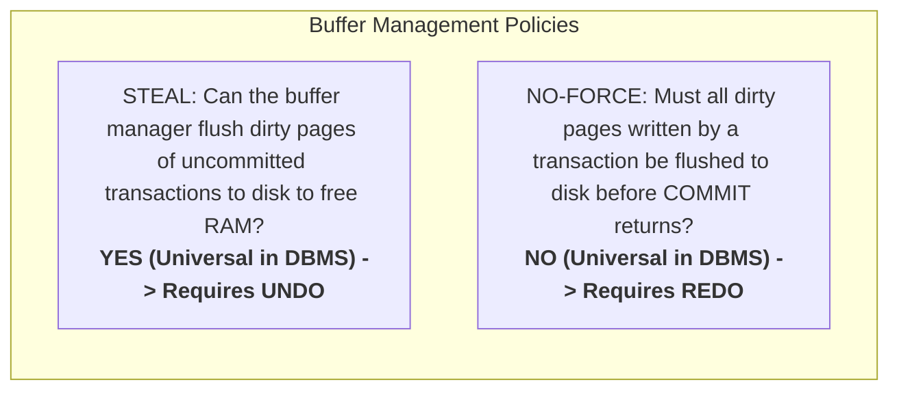
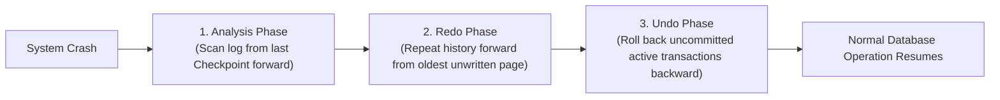

# Write-Ahead Logging & ARIES Crash Recovery

How does a database guarantee the **Durability** and **Atomicity** of transactions without writing every dirty data page synchronously to disk on `COMMIT`? 

The answer is **Write-Ahead Logging (WAL)** and the seminal **ARIES** (Algorithms for Recovery and Isolation Exploiting Semantics) recovery protocol designed by C. Mohan at IBM.

---

## 1. The Buffer Pool Policy: Steal / No-Force

A database buffer pool manages pages cached in memory. Its recovery requirements are dictated by two architectural decisions:



- **Why STEAL / NO-FORCE?**
  Forcing dirty pages to disk on commit destroys throughput due to random I/O. Forbidding steal would cause the database to run out of memory when transactions modify large datasets.
- **The Trade-off**: Supporting STEAL requires an **UNDO** logging mechanism; supporting NO-FORCE requires a **REDO** logging mechanism.

---

## 2. The Golden Rule of WAL & LSNs

> **The Write-Ahead Logging Invariant**: 
> A log record describing a database change must be written and flushed to durable storage **BEFORE** the corresponding modified data page can be written to disk.

$$\text{FlushedLSN} \ge \text{PageLSN}$$

Every log record is assigned a monotonically increasing 64-bit integer called a **Log Sequence Number (LSN)**. Every page header contains a `PageLSN` recording the LSN of the most recent mutation applied to it:

```c
// Kernel check before flushing page to disk:
if (page->page_lsn > wal_subsystem->flushed_lsn) {
    wal_subsystem->flush_wal_up_to(page->page_lsn); // Ensure WAL is durable first!
}
disk_write(page);
```

---

## 3. The 3 Phases of ARIES Recovery

When a server crashes (power failure, OS panic), ARIES restores consistent state through three distinct sequential phases:



### Phase 1: Analysis
- Begins at the most recent **Checkpoint** log record.
- Reconstructs the internal state at the time of the crash:
  - **Transaction Table**: Which transactions were active ("losers") when the system crashed.
  - **Dirty Page Table (DPT)**: Which pages were dirty in the buffer pool, and the minimum `RecLSN` (oldest unwritten modification).

### Phase 2: Redo ("Repeating History")
- Scans forward from the smallest `RecLSN` in the DPT.
- Reapplies **all changes** (both committed and uncommitted transactions) to return the database to the exact state it held at the millisecond of failure.
- Redo is **idempotent**: if `page.PageLSN >= record.LSN`, the page already has the modification on disk and the redo step is skipped!

### Phase 3: Undo
- Scans backward through the WAL from the crash point.
- Rolls back all mutations executed by the active uncommitted "loser" transactions identified in Phase 1.
- Writes **Compensation Log Records (CLRs)** for every undone mutation. Because CLRs log the rollback itself, the system can crash and restart during Phase 3 without entering an infinite recovery loop!
