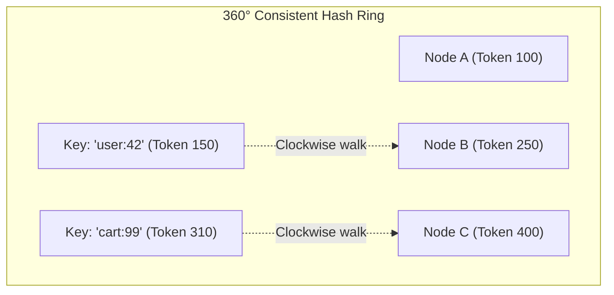
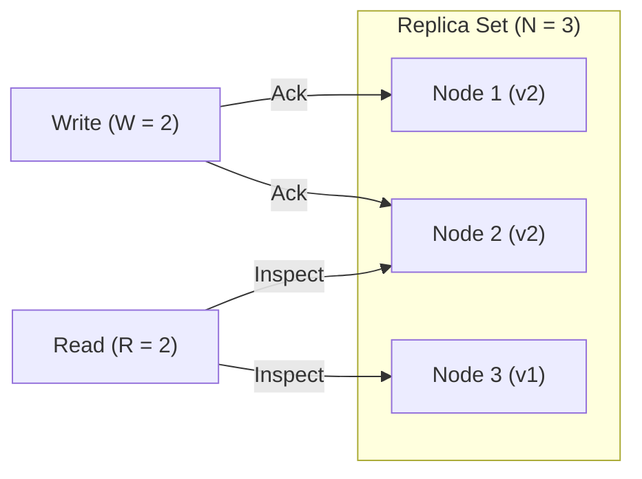

# Consistent Hashing & Quorum Systems

In 2007, Amazon published the seminal **Dynamo paper**, detailing how to build distributed, highly available key-value stores capable of scaling across thousands of commodity nodes. The architecture powers modern distributed databases like **Apache Cassandra**, **Amazon DynamoDB**, and **Riak**.

---

## 1. Consistent Hashing & The Hash Ring

In naive hash partitioning, assigning keys via `hash(key) % N` fails when adding or removing a node, because **almost every key ($N-1/N$) maps to a different server**, triggering massive data migration.

**Consistent Hashing** maps both data keys and server nodes onto a circular $2^{128}$ or $2^{64}$ hash ring:



- To store a key, compute its hash, walk **clockwise** along the ring, and assign it to the first node encountered.
- When a node joins or leaves, **only keys in its immediate ring segment move**, leaving the rest of the cluster undisturbed ($K/N$ keys moved on average).

### Virtual Nodes (VNodes)
To prevent statistical hot spots and balance heterogeneous hardware, each physical machine is mapped to hundreds of **Virtual Nodes (VNodes)** distributed uniformly across the ring.

---

## 2. Tunable Quorum Systems: $R + W > N$

Dynamo-style databases allow developers to tune the balance between latency and consistency per request using three parameters:

- **$N$**: Replication Factor (number of distinct nodes storing a copy of the key).
- **$W$**: Write Quorum (number of replica acknowledgments required for a successful write).
- **$R$**: Read Quorum (number of replica responses consulted before returning a read).



### The Quorum Invariant: Strong Consistency
By the **Pigeonhole Principle**, if the write set and read set overlap by at least one node:

$$R + W > N$$

Any read quorum is mathematically guaranteed to encounter at least one replica containing the latest write. The client inspects timestamps or vector clocks, returns the newest value, and triggers background **Read Repair** to update stale nodes.

### Tunable Configurations

| Configuration ($N=3$) | Strong Consistency? | Read Latency | Write Latency | Fault Tolerance |
| :--- | :--- | :--- | :--- | :--- |
| **$W=3, R=1$** | **Yes** | Ultra-Fast ($1\text{ ms}$) | Slow (waits for all 3) | Tolerates 0 node down on write |
| **$W=1, R=3$** | **Yes** | Slower (waits for all 3) | Ultra-Fast ($1\text{ ms}$) | High write availability |
| **$W=2, R=2$** | **Yes** | Fast (Majority) | Fast (Majority) | Tolerates 1 node down |
| **$W=1, R=1$** | **No** (Eventual) | Fastest | Fastest | Maximum availability |

---

## 3. Anti-Entropy with Merkle Trees

When replicas fall out of sync due to network partitions or machine reboots, they must reconcile data without transmitting gigabytes of identical records over the network.

A **Merkle Tree** is a hierarchical cryptographic hash tree where parent nodes store hashes of their children:

```
                  [Root Hash: H(A+B)]
                     /            \
           [Hash A: H(L1+L2)]      [Hash B: H(L3+L4)]
              /          \            /          \
          [Hash L1]   [Hash L2]   [Hash L3]   [Hash L4]
          (Key 1-10)  (Key 11-20) (Key 21-30) (Key 31-40)
```

1. Nodes exchange only their top-level **Root Hash** ($O(1)$ transfer).
2. If root hashes match, replicas are identical; zero data transfer is needed!
3. If they differ, nodes exchange child hashes down the tree, pinpointing the exact differing key range in $O(\log N)$ time and replicating only the missing rows.
