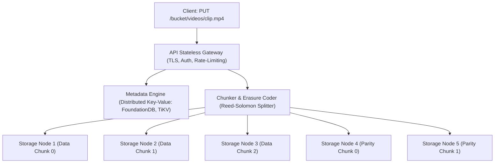

# Object Storage & S3 Internals

Modern cloud architectures treat **Object Storage** (Amazon S3, Google Cloud Storage, MinIO, Ceph) as the primary storage tier for data lakes, backups, and media. Unlike POSIX filesystems that support hierarchical directories and byte-level in-place mutation, object stores operate on **immutable binary blobs** via REST HTTP APIs.

---

## 1. Object Storage vs POSIX Filesystem

| Feature | POSIX Filesystem (ext4, NFS) | Cloud Object Store (S3, MinIO) |
| :--- | :--- | :--- |
| **Namespace** | Hierarchical directory tree (`/a/b/c/file.txt`) | Flat key-value namespace (`bucket/prefix/object-key`) |
| **Data Mutability** | In-place random byte overwrites (`lseek()` + `write()`) | **Strictly Immutable** (mutations require full re-upload or versioning) |
| **Protocol** | Kernel VFS syscalls (`open`, `read`, `write`) | HTTP/1.1 & HTTP/2 REST APIs (`GET`, `PUT`, `DELETE`) |
| **Scalability Limit** | Millions of files per filesystem | **Trillions of objects per bucket** |
| **Metadata** | Fixed POSIX attributes (owner, mode, mtime) | Custom key-value user metadata tags attached to object |

---

## 2. Decoupled Architecture: Metadata vs Storage Nodes

Exabyte-scale object stores decouple metadata indexing from physical blob storage:



1. **Metadata Tier**: A distributed ACID database storing object names, size, etags, version IDs, and block location pointers.
2. **Storage Blob Tier**: Massive clusters of commodity storage servers using raw block devices (e.g. **Ceph BlueStore**) that write directly to NVMe/HDD disks without local filesystem overhead.

---

## 3. Reed-Solomon Erasure Coding ($k + m$)

In small systems, triple replication ($3\times$) provides fault tolerance. However, for a $100\text{ Petabyte}$ archive, $3\times$ replication requires buying $300\text{ PB}$ of hardware ($200\text{ PB}$ overhead!).

Object stores solve this using **Reed-Solomon Erasure Coding ($k + m$)**:

```
+-------------------------------------------------------------+
| Original Object (e.g. 12 MB)                                |
+-------------------------------------------------------------+
        | Split into k = 4 Data Chunks (3MB each)
        v
 [D0: 3MB] [D1: 3MB] [D2: 3MB] [D3: 3MB]
        |
        | Vandermonde / Cauchy Matrix Multiplication in GF(2^8)
        v
 [P0: 3MB] [P1: 3MB]  <--- m = 2 Parity Chunks
```

- An object is divided into $k$ data chunks, and $m$ mathematical parity chunks are generated using Galois Field $GF(2^w)$ matrix arithmetic.
- The resulting $k + m$ chunks are distributed across $k + m$ independent server racks or fault domains.
- **The Recovery Property**: **Any $k$ out of the $k + m$ chunks are sufficient to reconstruct the entire original object!** Up to $m$ storage nodes or racks can fail simultaneously with zero data loss.

### Economic Comparison

| Strategy | Scheme | Usable Capacity | Hardware Overhead | Fault Tolerance |
| :--- | :--- | :--- | :--- | :--- |
| **Triple Replication** | $3\times$ | $33\%$ | $+200\%$ | Tolerates 2 node failures |
| **Erasure Coding** | $8 + 4$ | $66.7\%$ | $+50\%$ | Tolerates **4 node/rack failures** |
| **High-Density EC** | $16 + 4$ | **$80.0\%$** | **$+25\%$** | Tolerates **4 node/rack failures** |

---

## 4. Silent Data Corruption & Bit Rot Protection

At exabyte scale, cosmic rays, electrical degradation, and firmware bugs routinely flip bits on magnetic platters without the drive reporting an I/O error (**Silent Bit Rot**).

To guarantee durability (e.g. AWS S3's "11 nines" or $99.999999999\%$):
- Every incoming chunk is hashed with **CRC32C / SHA-256** and signed.
- Background **Scrubbing Daemons** continually read all physical drives, recalculate checksums, and compare against metadata.
- If a chunk's checksum fails, the scrubber immediately invokes the Reed-Solomon decoder to reconstruct the corrupted chunk from healthy peers and writes it to a fresh drive.
