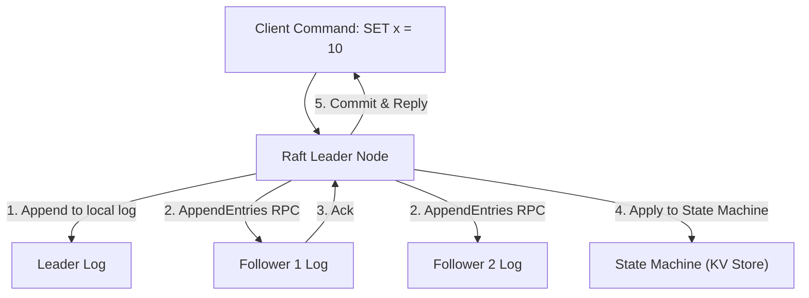
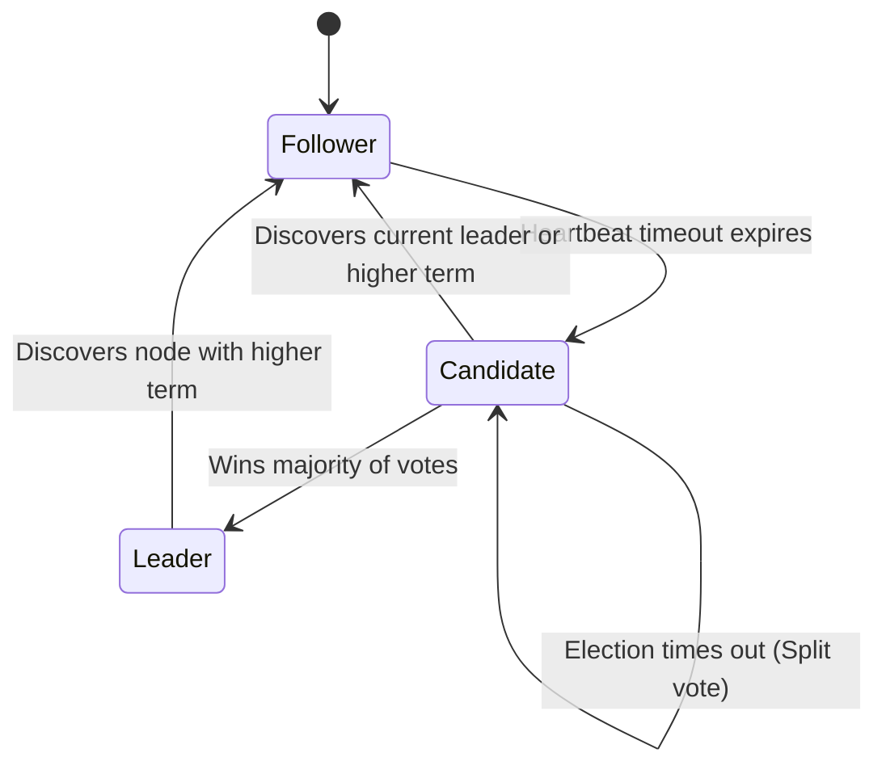

# Raft Consensus & Distributed State Machines

In distributed storage systems, consensus algorithms ensure that a cluster of machines agree on a sequence of state transitions, even in the presence of network partitions and node crashes.

**Raft** (designed by Ongaro & Ousterhout at Stanford) was created as an understandable alternative to Multi-Paxos and powers the metadata and storage layers of **etcd (Kubernetes)**, **CockroachDB**, **TiKV**, and **Kafka KRaft**.

---

## 1. The Replicated State Machine (RSM) Model

Consensus algorithms are implemented in terms of **Replicated State Machines**:



If two identical deterministic state machines start from the same initial state and apply the identical sequence of inputs in the identical order, they will produce the identical output state. Raft's entire job is to keep the **Replicated Log** identical across all nodes.

---

## 2. The Three Server States

A node in a Raft cluster operates in one of three roles at any given time:



1. **Follower**: Passive. Only responds to RPCs from Candidates and Leaders. If it receives no heartbeats within an election timeout, it assumes the leader is dead and transitions to Candidate.
2. **Candidate**: Increments the current **Term**, votes for itself, and broadcasts `RequestVote` RPCs to all peers.
3. **Leader**: Handles all client requests, coordinates log replication via `AppendEntries` RPCs, and sends periodic empty heartbeats to maintain authority.

---

## 3. Leader Election & Randomized Timeouts

To prevent **Split-Vote Brain Split** (where two candidates start an election simultaneously and divide votes evenly), Raft utilizes **Randomized Election Timeouts** (typically between $150\text{ ms} - 300\text{ ms}$).

The node whose randomized timer expires first increments the Term, votes for itself, and requests votes. By the time slower nodes wake up, the faster node has already secured a majority of votes!

---

## 4. Raft Safety Invariants

Raft guarantees correctness through five core invariants:

| Invariant | Guarantee |
| :--- | :--- |
| **Election Safety** | At most one leader can be elected in a given term. |
| **Leader Append-Only** | A leader never overwrites or truncates its own log; it only appends new entries. |
| **Log Matching Property** | If two logs contain an entry with the same index and term, they are identical in all entries up through the given index. |
| **Leader Completeness** | If a log entry is committed in a given term, that entry will be present in the logs of the leaders for all higher terms. |
| **State Machine Safety** | If a server has applied a log entry at a given index to its state machine, no other server will ever apply a different log entry for the same index. |

### The Election Constraint Rule
A follower will **reject** a vote request if the candidate's log is less up-to-date than its own log:
```
(Candidate.LastLogTerm > Follower.LastLogTerm) OR 
((Candidate.LastLogTerm == Follower.LastLogTerm) AND (Candidate.LastLogIndex >= Follower.LastLogIndex))
```
This guarantees that any newly elected leader already contains every committed entry from all previous terms!
