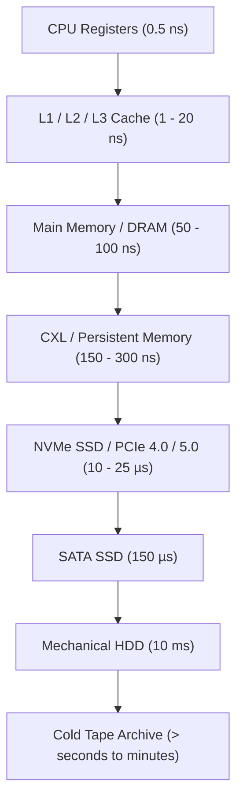

import LatencyExplorer from '@site/src/components/Interactive/LatencyExplorer';

# Latency Numbers Explorer

:::tip MDN Reference
In storage engineering, hardware mechanical sympathy begins with understanding the **physical orders of magnitude** separating CPU registers from magnetic disks and remote network hops.
:::

<LatencyExplorer />

---

## The Storage Latency Hierarchy

In modern computer architecture, memory and storage media form a strict hierarchy governed by the trade-off between **access speed**, **cost per gigabyte**, and **volatility**.

### Key Engineering Takeaways

1. **The DRAM to SSD Chasm**:
   Accessing RAM (~100 ns) is **100x faster** than fetching a 4KB block from a cutting-edge NVMe SSD (~10 µs), and **100,000x faster** than a rotational HDD seek (~10 ms).
2. **Sequential vs Random I/O**:
   Sequential access allows hardware controllers to trigger hardware prefetching, saturate PCIe lanes, and pipeline requests, outperforming random small I/O by orders of magnitude even on solid-state media.
3. **Network vs Disk Paradox**:
   On modern optical 100 GbE datacenter networks with RDMA (Remote Direct Memory Access), reading memory on a remote server (~5-10 µs) can be **faster** than issuing a random read to a local SATA SSD (~150 µs).
