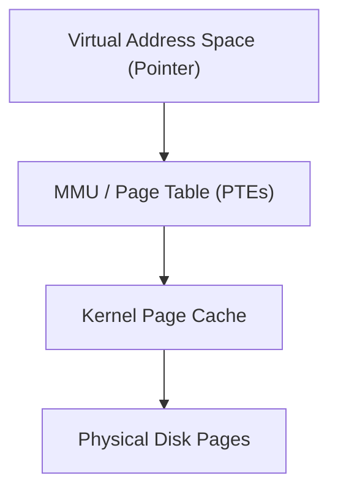
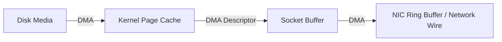

# Direct I/O, mmap & Zero-Copy Primitives

When building high-throughput databases and stream processors, the standard `read()` and `write()` abstractions often introduce unacceptable overhead: **double caching**, **unnecessary `memcpy()` passes**, and **context switching**.

---

## 1. Direct I/O (`O_DIRECT`)

By default, Linux copies data between userspace memory and the kernel page cache. For an enterprise database like MySQL InnoDB, ScyllaDB, or Oracle, this creates **Double Buffering**:
- The database engine already manages its own internal LRU **Buffer Pool** in userspace memory.
- The operating system keeps duplicate copies in the kernel **Page Cache**.
- Half the system RAM is wasted on redundant data!

### Opening Files with `O_DIRECT`

```c
#define _GNU_SOURCE
#include <fcntl.h>

int fd = open("/data/storage.db", O_RDWR | O_DIRECT);
```

When `O_DIRECT` is asserted:
1. The kernel completely bypasses the page cache.
2. The DMA (Direct Memory Access) controller transfers bytes directly between the storage controller and userspace application memory buffers.
3. **Strict Alignment Rule**: Memory buffers, file offsets, and I/O lengths must be strictly aligned to the filesystem/disk physical sector size (typically 4096 bytes on modern 4Kn NVMe drives):

```c
void* buffer;
// Allocate memory aligned to 4096-byte boundary
if (posix_memalign(&buffer, 4096, 4096 * 16) != 0) {
    perror("Memory alignment failed");
}
```

---

## 2. Memory-Mapped Files (`mmap`)

The `mmap()` system call maps a file's byte range directly into the virtual address space of a process:

```c
void *addr = mmap(NULL, file_size, PROT_READ | PROT_WRITE, MAP_SHARED, fd, 0);
// Read or write like a normal C pointer:
uint64_t magic = *(uint64_t*)addr;
```



### Advantages of `mmap`
- **Zero-Copy Access**: Dereferencing a pointer accesses the kernel page cache directly; no userspace `memcpy()` is required.
- **Simplicity**: No need to manage complex buffer offsets or call `read()` / `seek()`. Used by **LMDB**, **SQLite**, and **Kafka index files**.

### The Pitfalls of `mmap` for Large Databases
1. **Unpredictable Page Fault Latency**: A pointer read can trigger an un-interruptible blocking major page fault if the page is evicted.
2. **Crash Vulnerability (`SIGBUS`)**: If another process or disk failure truncates the underlying file while mapped, pointer access triggers an immediate fatal `SIGBUS` signal.
3. **TLB Shootdowns**: On high-core servers, modifying page table entries causes expensive Inter-Processor Interrupts (IPIs) across CPU cores.

---

## 3. Zero-Copy Streaming: `sendfile()` & `splice()`

Traditional network servers reading from disk and sending over a socket execute 4 context switches and 3 buffer copies:

```
Disk -> Page Cache -> Userspace Buffer -> Socket Buffer -> NIC DMA
         [Copy 1]         [Copy 2]         [Copy 3]
```

### The `sendfile()` Optimization

With `sendfile(socket_fd, file_fd, NULL, count)`, the kernel streams pages directly from the Page Cache into the Network Interface Card (NIC) buffer:



:::tip Production Case Study: Apache Kafka
Kafka achieves millions of messages per second per broker largely because of **`sendfile()`**. Once message batches are stored in the OS page cache, Kafka transmits them directly to thousands of consumer network connections without copying a single byte into Java heap memory!
:::
