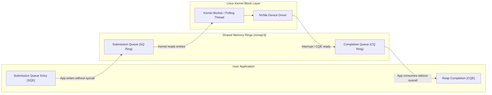

# io_uring vs epoll vs Native AIO

For over two decades, Linux network servers scaled via `epoll`. However, when dealing with persistent file storage, `epoll` fails completely. The introduction of **`io_uring`** in Linux 5.1 revolutionized Linux storage I/O, allowing millions of IOPS per core with zero system calls.

---

## 1. Why `epoll` Cannot Handle Regular Disk Files

A common misconception among developers is that `epoll` can asynchronously multiplex disk file descriptors:

```c
// THIS DOES NOT WORK AS ASYNCHRONOUS I/O!
epoll_ctl(epfd, EPOLL_CTL_ADD, file_fd, &ev);
```

Under Linux, **regular disk files are always reported as "ready" by `epoll`**. When an application subsequently issues `read()` on a block that is not cached in memory, **the thread blocks synchronously in the kernel** while the storage controller services the I/O interrupt!

---

## 2. The Failures of Linux Native AIO (`io_submit`)

Linux added kernel AIO (`io_submit` / `io_getevents`) to support database engines like Oracle. However, it had critical architectural flaws:
1. **Required `O_DIRECT`**: Only worked if the page cache was completely bypassed. Buffered I/O fell back to synchronous execution!
2. **Synchronous Metadata Stalls**: If file extension required allocating an indirect block or updating an inode, `io_submit` blocked synchronously.
3. **High Syscall Overhead**: Two system calls required per batch of I/O operations (`io_submit` to dispatch, `io_getevents` to reap).

---

## 3. The `io_uring` Architecture

Created by Linux block maintainer Jens Axboe, **`io_uring`** solves all previous limitations using two shared-memory circular ring buffers:



### Key Architectural Innovations

1. **Shared Ring Buffers (Zero Syscall Submissions)**:
   The Submission Queue (SQ) and Completion Queue (CQ) are memory-mapped into user space. An application places I/O requests into the SQ and reads results from the CQ using atomic memory barriers with zero syscall overhead.
2. **Unified API**:
   Works identically across buffered disk files, `O_DIRECT` files, network sockets, timers, and inter-process communication.
3. **Kernel Polling Mode (`IORING_SETUP_SQPOLL`)**:
   A dedicated kernel thread constantly polls the SQ ring. Once enabled, the application can issue millions of disk reads and writes without executing a single `enter()` syscall!
4. **Operation Chaining (`IOSQE_IO_LINK`)**:
   Enables chaining dependent operations together. For example: `read() -> transform -> write() -> fsync()` can be submitted as a single linked pipeline.

---

## 4. Performance Comparison

| Mechanism | Buffered File Support | Sycall Overhead per I/O | Zero-Copy Support | Max IOPS (Single Core) |
| :--- | :--- | :--- | :--- | :--- |
| **POSIX `read()` / `write()`** | Yes | 1 syscall per operation | No | $\approx 250,000$ |
| **Linux Native AIO (`io_submit`)**| **No** (Direct I/O only) | 2 syscalls per batch | No | $\approx 650,000$ |
| **`io_uring` (default interrupt)** | **Yes** | 1 syscall per batch | Yes (fixed buffers) | $\approx 1,200,000$ |
| **`io_uring` (`SQPOLL` mode)** | **Yes** | **0 syscalls** | Yes (fixed buffers) | **$> 3,000,000+$** |

:::note Production Adoptions
Modern high-performance storage engines like **ScyllaDB**, **QEMU**, **RocksDB (io_uring plugin)**, and **ClickHouse** have transitioned to `io_uring` for their primary I/O pathways on modern Linux kernels.
:::
