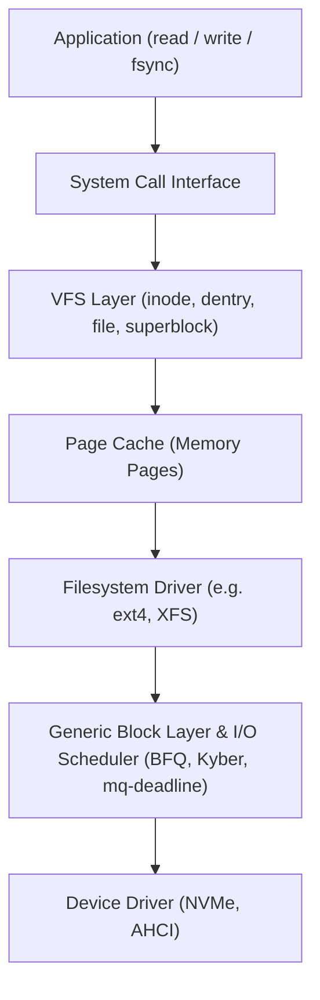

# Linux VFS & The Page Cache

The Linux operating system mediates all disk interactions through two primary abstractions: the **Virtual File System (VFS)** and the **Page Cache**. Understanding how the kernel buffers reads and writes is essential for tuning high-throughput storage engines.

---

## 1. The Virtual File System (VFS) Architecture

The VFS provides a unified, object-oriented abstraction over heterogeneous storage devices, network filesystems, and pseudo-filesystems (ext4, XFS, ZFS, NFS, Btrfs, sysfs).



### The 4 Core VFS Objects

1. **Superblock**: Represents an entire mounted filesystem. Stores block size, max file size, and pointers to root inodes.
2. **Inode**: Represents a specific file or directory on disk. Contains file metadata (permissions, owner, size, timestamps, block pointers), but **not the filename**.
3. **Dentry (Directory Entry)**: Associates a human-readable pathname component (`/var/data/db.wal`) with an inode number. Cached in memory via the high-speed **dcache**.
4. **File Object**: Represents an open file instance created when a process invokes `open()`. Maintains current seek offset (`f_pos`), access flags (`O_RDWR`), and reference counts.

---

## 2. The Linux Page Cache

Whenever a process calls `read()` or `write()`, Linux checks the **Page Cache** before issuing physical I/O:

- **Read Hit**: If the requested 4KB page is already resident in DRAM, the kernel copies it directly to userspace memory via `memcpy()`. Latency is $\approx 100\text{ ns}$ instead of milliseconds.
- **Read Miss**: The kernel allocates a physical page frame, schedules a block I/O request (`bio`) to disk, puts the process to sleep, and wakes it when the interrupt fires.
- **Write Path**: Writes are written to the page in DRAM and marked **dirty**. The `write()` system call returns immediately to the caller!

### The XArray / Radix Tree Index

Inside `struct address_space`, the kernel indexes pages belonging to each file using an **XArray** (formerly radix tree). This enables $O(\log_{64} N)$ lookups of any 4KB page offset within a multi-terabyte file.

---

## 3. Dirty Page Writeback & Flushing

Dirty pages do not stay in memory indefinitely; background kernel threads (`kworker/flush`) wake up periodically to write dirty pages to persistent media based on kernel sysctl parameters:

```bash
# View active kernel writeback thresholds:
sysctl vm.dirty_background_ratio
sysctl vm.dirty_ratio
sysctl vm.dirty_expire_centisecs
sysctl vm.dirty_writeback_centisecs
```

| Parameter | Default | Meaning |
| :--- | :--- | :--- |
| `vm.dirty_background_ratio` | 10% | Percentage of system memory dirty before background kernel flushers start writing to disk. |
| `vm.dirty_ratio` | 20% | Upper limit. If dirty pages exceed this, **processes calling write() are blocked** until pages are cleaned! |
| `vm.dirty_expire_centisecs` | 3000 (30s) | How old a dirty page must be before it is eligible for background flushing. |

:::caution The Flush Stall Gotcha
On high-RAM database servers (e.g. 512GB RAM), the default 20% `vm.dirty_ratio` means 100GB of dirty data can accumulate. When flushers wake up or a process calls `sync()`, the I/O bus saturates, freezing database transactions for tens of seconds! 

**Production Recommendation**: Set byte-based limits:
```bash
sudo sysctl -w vm.dirty_background_bytes=134217728  # 128 MB
sudo sysctl -w vm.dirty_bytes=536870912             # 512 MB
```
:::

---

## 4. Durability Semantics: `fsync` vs `fdatasync`

Because standard `write()` calls merely dirty the page cache, a power failure or OS crash will result in data loss unless explicit sync primitives are called:

- **`fsync(int fd)`**: Flushes dirty page cache buffers **and** all associated inode metadata (size, mtime, permissions) to disk. Often requires two separate disk writes (one for data, one for journal/metadata).
- **`fdatasync(int fd)`**: Flushes only the dirty data pages required to read the file correctly. Skips metadata flushes if the file length has not changed, saving a full disk sync operation on append-heavy logs!
- **`sync_file_range()`**: Linux-specific syscall allowing asynchronous, non-blocking submission of dirty page flushes in a specific byte range.
