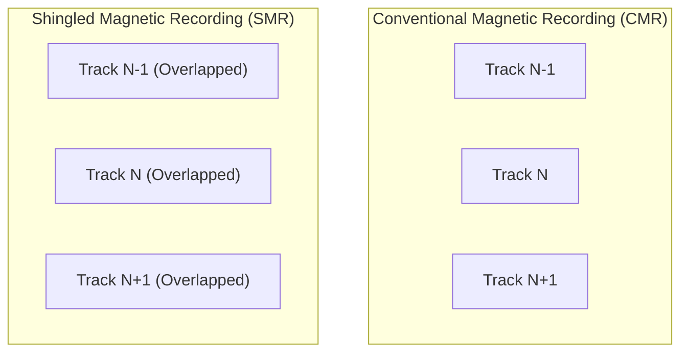

# HDDs & Magnetic Media Internals

While solid-state drives dominate hot transactional tiers, **Hard Disk Drives (HDDs)** and **Magnetic Tape** store the vast majority of global data (over 80% in hyperscale datacenters) due to unbeatable economics per terabyte ($/GB).

---

## 1. Mechanical Anatomy of an HDD

A hard disk drive stores digital bits by polarizing ferromagnetic material on rotating glass or aluminum platters:

```
          [Actuator Voice Coil Motor]
                     \
                      \ === [Head Arm]
                             \
                         [Read/Write Slider Head] (~5 nm flying height!)
                              |
               +--------------v--------------+
               |  ( ( ( ( ( Platter ) ) ) )  |  <--- 7200 RPM Spindle Motor
               +-----------------------------+
```

### Components of Latency

The total latency required to read a random sector from a spinning platter is the sum of three physical operations:

$$\text{Total Latency} = t_{\text{seek}} + t_{\text{rotational}} + t_{\text{transfer}}$$

1. **Seek Time ($t_{\text{seek}}$)**: The time for the mechanical voice coil actuator to accelerate and position the head over the correct track ($3 - 9\text{ ms}$).
2. **Rotational Latency ($t_{\text{rotational}}$)**: The time waiting for the target sector to rotate underneath the head. On average, this is half a revolution:
   $$t_{\text{rot}} = \frac{1}{2} \cdot \frac{60}{\text{RPM}} = \frac{30}{7200} \approx 4.17\text{ ms}$$
3. **Transfer Time ($t_{\text{transfer}}$)**: Time to read the bits off the magnetic track into the onboard controller cache ($\approx 10 - 20\mu\text{s}$ for 4KB).

Because seek and rotational latencies dominate, random 4KB I/O yields only **$75 - 150\text{ IOPS}$**, whereas sequential streaming saturates platter surface density at **$200 - 280\text{ MB/s}$**.

---

## 2. CMR vs SMR (Shingled Magnetic Recording)

To increase areal density beyond standard limits, disk manufacturers introduced **SMR**:



- **CMR (PMR)**: Tracks are arranged side-by-side with discrete guard spaces. Any track can be overwritten without disturbing neighbors.
- **SMR**: Tracks overlap like roof shingles because write heads are physically wider than read heads. Overwriting track $N$ destroys track $N+1$!

### SMR Deployment Types

1. **Drive-Managed (DM-SMR)**: The HDD firmware attempts to emulate a normal disk using an internal translation cache. **Dangerous for databases**; random write workloads cause catastrophic latency cliffs (seconds to minutes).
2. **Host-Managed (HM-SMR / ZBC / ZAC)**: The operating system and database engine explicitly control sequential append-only **Zones** using the Linux Zoned Block Device interface (`blkzone`).

---

## 3. Advanced Magnetic Technologies

- **HAMR (Heat-Assisted Magnetic Recording)**: Uses a 200mW microscopic diode laser to momentarily heat the magnetic grain to 400°C, lowering coercivity to write smaller bits on FePt media.
- **Helium Sealed Drives**: Platters spin in low-density inert helium gas, drastically reducing turbulence and drag, allowing 10-12 platters in a standard 3.5" chassis.
- **Magnetic Tape (LTO-9)**: Stores up to 18TB uncompressed per cartridge on thin magnetic tape with a 30-year archival lifespan and near-zero power consumption when sitting in a tape library slot.
