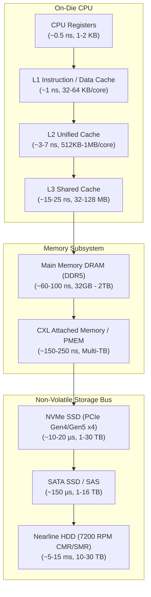

# The Memory & Storage Hierarchy

Modern computer systems are governed by a fundamental physical constraint: **signals cannot travel faster than the speed of light in silicon ($\approx 15\text{ cm/ns}$)**. As a result, the closer storage media is to the execution ALU, the faster and more expensive it becomes.

:::note Mechanical Sympathy
Software performance at scale depends on understanding how data flows through physical caches, memory controllers, and PCIe lanes. Code that thrashes cache lines or triggers random disk seeks will be orders of magnitude slower than code aligned with hardware topologies.
:::

---

## The Physical Hierarchy



---

## Memory Layer Specifications

| Layer | Medium | Typ. Latency | Typ. Bandwidth | Volatile? | Managed By |
| :--- | :--- | :--- | :--- | :--- | :--- |
| **Registers** | Flip-flops / Static latches | $0.5\text{ ns}$ | $> 1\text{ TB/s}$ | Yes | Compiler / Register Allocator |
| **L1d Cache** | SRAM (6T/8T cells) | $1 - 1.5\text{ ns}$ | $\approx 400\text{ GB/s}$ | Yes | Hardware CPU Core |
| **L2 Cache** | SRAM | $3 - 7\text{ ns}$ | $\approx 200\text{ GB/s}$ | Yes | Hardware CPU Core |
| **L3 Cache** | SRAM (eDRAM) | $15 - 25\text{ ns}$ | $\approx 100\text{ GB/s}$ | Yes | Shared Ring / Mesh Bus |
| **DRAM (DDR5)** | Dynamic capacitors | $60 - 100\text{ ns}$ | $30 - 80\text{ GB/s}$ per ch. | Yes | Memory Controller / MMU |
| **CXL Memory** | CXL.mem over PCIe 5.0 | $150 - 250\text{ ns}$ | $32 - 64\text{ GB/s}$ | Configurable | CXL Controller / Linux Tiering |
| **NVMe Gen5** | 3D TLC/QLC NAND | $10 - 25\mu\text{s}$ | $7 - 14\text{ GB/s}$ | **No** | NVMe Host Driver / FTL |
| **Mechanical HDD**| Magnetic Platters | $5 - 15\text{ ms}$ | $150 - 280\text{ MB/s}$ | **No** | Block Layer / SCSI/SATA HBA |

---

## Cache Line Alignment & False Sharing

CPUs do not read single bytes from DRAM; they fetch memory in discrete **Cache Lines** (typically 64 bytes on x86-64 and ARM64).

### The False Sharing Pitfall

When two threads running on different cores mutate distinct variables that happen to share the same 64-byte cache line, the CPU cache coherency protocol (**MESI / MOESI**) invalidates the entire cache line across cores on every store.

```c
// Anti-pattern: Two hot counters located in the same 64-byte cache line
struct StatsBad {
    uint64_t thread1_ops; // 8 bytes \ Same 64-byte cache line!
    uint64_t thread2_ops; // 8 bytes / Triggers ping-pong invalidations
};

// Optimized: Explicit 64-byte alignment padding eliminates false sharing
struct StatsGood {
    alignas(64) uint64_t thread1_ops; // Dedicated 64-byte line
    alignas(64) uint64_t thread2_ops; // Dedicated 64-byte line
};
```

---

## The PCIe Bus & NVMe Protocol

Before NVMe, solid-state disks connected through SATA/AHCI controllers designed for slow mechanical spinning disks, restricted to a **single queue with a depth of 32 commands**.

NVMe (Non-Volatile Memory Express) was engineered specifically for low-latency solid-state media over the PCIe bus:
- **Up to 64,000 parallel queues**.
- **Up to 64,000 commands per queue**.
- Direct CPU-to-controller communication without legacy locking.
- MSI-X interrupt steering mapped directly to CPU cores.

:::tip Next Section
Explore how solid-state drives physically store charge and organize flash blocks in [NAND Flash, FTL & SSD Internals](/docs/physical-layer/ssd-nand-ftl).
:::
