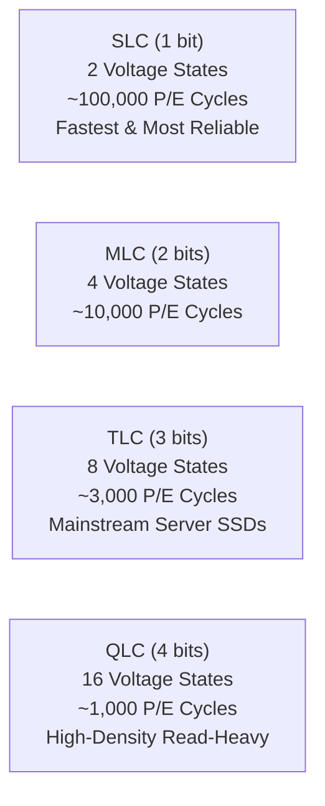

# NAND Flash, FTL & SSD Internals

Solid-State Drives (SSDs) are non-volatile storage devices built around arrays of **NAND flash memory chips**. Unlike rotating magnetic disks that can overwrite sectors in-place, NAND flash has strict physical constraints that require a complex onboard operating system: the **Flash Translation Layer (FTL)**.

---

## 1. NAND Flash Cell Technologies

Flash cells trap electrons inside an insulated floating gate or silicon nitride charge trap layer. The number of discrete voltage states programmed into each cell determines the bits per cell:



| Cell Type | Bits / Cell | Voltage States | Program Latency ($t_{PROG}$) | Typical P/E Cycles | Relative Cost |
| :--- | :--- | :--- | :--- | :--- | :--- |
| **SLC** (Single-Level) | 1 | 2 | $\approx 200 - 300\mu\text{s}$ | $50,000 - 100,000$ | Highest |
| **MLC** (Multi-Level) | 2 | 4 | $\approx 600 - 900\mu\text{s}$ | $3,000 - 10,000$ | High |
| **TLC** (Triple-Level) | 3 | 8 | $\approx 1,000 - 1,500\mu\text{s}$ | $1,000 - 3,000$ | Moderate |
| **QLC** (Quad-Level) | 4 | 16 | $\approx 2,500 - 4,000\mu\text{s}$ | $500 - 1,000$ | Lowest |

---

## 2. The Fundamental Page / Block Asymmetry

NAND flash media suffers from a physical asymmetry that dictates modern storage software design:

> **You Read and Program in Pages (typically 4KB to 16KB), but you can only Erase in Blocks (typically 4MB to 16MB).**

Before any flash cell can be rewritten from `0` to `1`, a high-voltage electrical pulse must reset the entire **Block** (composed of hundreds of pages) back to all `1`s.

```
+-----------------------------------------------------------+
| FLASH ERASE BLOCK (e.g. 8 MB)                             |
|  [Page 0: 16KB] [Page 1: 16KB] [Page 2: 16KB] ...        |
|  Read/Write: 16KB granularity                             |
|  Erase: Entire 8MB Block simultaneously                   |
+-----------------------------------------------------------+
```

Because erasing an entire 8MB block to overwrite a single 4KB page is physically prohibitive, SSDs **never overwrite data in-place**. Instead, they write to a fresh page and mark the old page as **invalid**.

---

## 3. The Flash Translation Layer (FTL)

The FTL is a micro-operating system executed by the multicore ARM controller on the SSD PCB. It presents the SSD to the host operating system as a linear array of **Logical Block Addresses (LBAs)**, mapping them dynamically to physical locations (**Physical Block Addresses, PBAs**).

### Primary Responsibilities of the FTL

1. **LBA-to-PBA Address Mapping**:
   Maintains an address translation table (cached in the SSD's onboard DRAM).
2. **Out-of-Place Writes**:
   Redirects overwrite requests to empty physical pages, updating the mapping table.
3. **Wear Leveling**:
   Distributes write and erase cycles evenly across all physical flash blocks to prevent premature localized cell breakdown (Dynamic vs Static Wear Leveling).
4. **Garbage Collection (GC)**:
   Scans blocks with high ratios of invalid pages, copies remaining valid pages to a new clean block, and issues an erase command to reclaim the old block.
5. **Bad Block Management & ECC**:
   Detects failing cells using LDPC (Low-Density Parity-Check) error correction codes and retires worn-out blocks.

---

## 4. Write Amplification Factor (WAF)

Because Garbage Collection must copy surviving valid pages before erasing a block, the number of bytes physically written to NAND flash is greater than the number of bytes sent by the host application.

$$\text{WAF} = \frac{\text{Bytes Written to NAND Flash}}{\text{Bytes Written by Host OS}}$$

- **Ideal WAF**: $1.0$ (every host write goes to a clean page without GC data movement).
- **Poor WAF**: $3.0 - 10.0+$ (random small 4KB writes fragment blocks, triggering heavy GC data copying and rapid SSD wear).

:::warning The Database Engineering Impact
A database engine that randomly updates 4KB pages in-place (such as classic B-Trees) degrades SSD endurance and causes latency spikes during GC. Modern engines (LSM-trees like RocksDB or ClickHouse MergeTree) append large sequential runs to maintain a WAF close to 1.
:::

---

## 5. The TRIM / UNMAP Command

When an operating system deletes a file, standard filesystem drivers only modify metadata (inodes/bitmaps). Without explicit signaling, the SSD controller cannot distinguish deleted file blocks from active data and will wastefully copy "deleted" pages during Garbage Collection!

The **TRIM** command (ATA) / **UNMAP** (SCSI) / **Dataset Management Deallocate** (NVMe) allows the operating system to notify the FTL that a range of LBAs is no longer needed.

```bash
# In Linux, run manual TRIM across mounted filesystems:
sudo fstrim -va

# Or check discarded block status with blkdiscard:
sudo blkdiscard --secure /dev/nvme0n1
```
