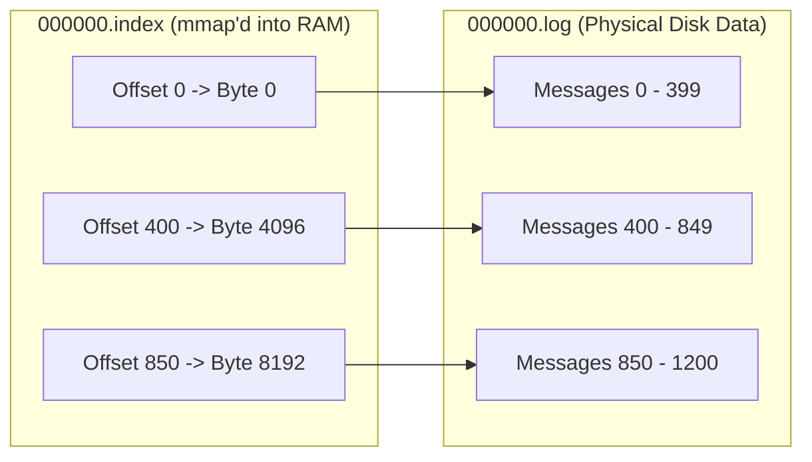

# Append-Only Segmented Logs

The **Append-Only Log** is the simplest and most robust storage primitive in computer science: an ordered, append-only sequence of immutable records indexed by monotonically increasing offsets.

It forms the foundational engine of event streams like **Apache Kafka**, **Apache Pulsar**, **Redpanda**, and the Write-Ahead Logs of distributed databases.

---

## 1. Segmented Log Architecture

A single infinite file is unmanageable: it cannot be deleted in chunks, is difficult to clean, and exhausts OS filesystem limits. Distributed logs solve this by dividing a partition into **Segments** (typically 1GB per file):

```
/var/lib/kafka/data/orders-0/
├── 00000000000000000000.log        # Raw message binary batches
├── 00000000000000000000.index      # Offset -> Physical Byte position
├── 00000000000000000000.timeindex  # Timestamp -> Offset
├── 00000000000010485760.log        # Active writable segment
├── 00000000000010485760.index
└── 00000000000010485760.timeindex
```

### The Active vs Inactive Segment
- **Active Segment**: The only file currently receiving incoming writes. Appends are strictly sequential.
- **Inactive Segments**: Fully written, immutable files. Safe to serve concurrent consumer reads, compress, or delete based on retention policies.

---

## 2. Sparse Offset Indexing

Storing an index entry for every single message would consume immense memory and I/O. Instead, segmented logs utilize **Sparse Indexing**:



### Lookup Execution Path
When a consumer requests message offset `620`:
1. **Binary Search in Index**: The broker performs an in-memory binary search in `000000.index` to find the largest indexed offset $\le 620$ (`Offset 400 -> Byte 4096`).
2. **Seek to Byte Offset**: The broker seeks directly to byte `4096` in `000000.log`.
3. **Sequential Scan**: Reads sequentially for a few hundred bytes until offset `620` is reached.

Because modern CPUs scan memory and disk page buffers at gigabytes per second, scanning a few kilobytes sequentially is significantly faster than maintaining a heavy dense index!

---

## 3. Log Retention: Cleanup vs Compaction

Modern logs offer two modes for managing disk capacity:

### 1. Delete Policy (Time or Size Based)
Segments older than the retention threshold (e.g. 7 days) or exceeding total partition quota (e.g. 500GB) are deleted in an instantaneous $O(1)$ filesystem `unlink()` operation.

### 2. Log Compaction (Key-Deduplicated State)
For stateful changelogs (such as database change data capture streams), the log acts as a table. **Compaction** scans segments and preserves only the **latest value** for each primary key, discarding older overwritten records:

```
Before: [K1:V1] [K2:V1] [K1:V2] [K3:V1] [K2:V3]
After:  [K1:V2] [K3:V1] [K2:V3]
```
