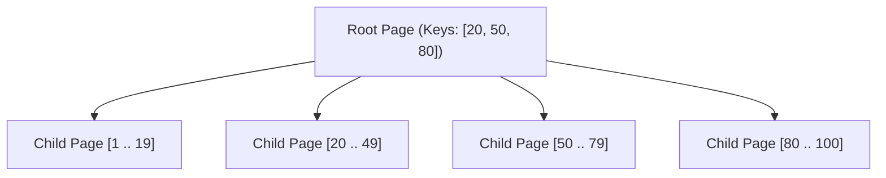
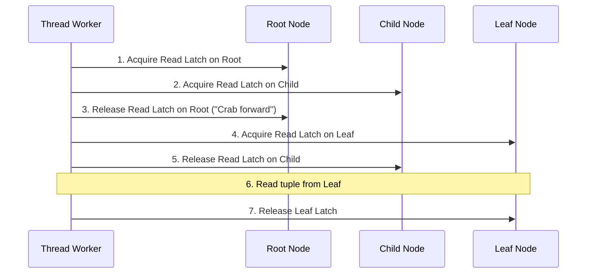

# B-Trees & B+ Trees

For more than five decades, the **B+ Tree** has stood as the gold standard for relational database storage engines (PostgreSQL, MySQL InnoDB, SQLite, Oracle). It is engineered specifically around hardware disk page boundaries to minimize I/O seeks for both point lookups and range scans.

---

## 1. Why Not Binary Search Trees?

In a balanced binary search tree (AVL or Red-Black tree) storing 100 million rows, the tree height is:

$$h = \log_2(100,000,000) \approx 27$$

If each node resides on disk, a point lookup requires traversing **27 separate disk blocks**!

A **B-Tree** maximizes the branching factor (**fanout $B$**) by grouping hundreds or thousands of keys into a single disk page (typically 4KB to 16KB):



With a fanout of $B = 500$, a B+ Tree storing 100 million entries requires a height of only:

$$h = \log_{500}(100,000,000) \approx 3$$

Because the root and internal levels are cached permanently in DRAM, finding any arbitrary row requires **at most 1 disk I/O**!

---

## 2. B-Tree vs B+ Tree

| Feature | Standard B-Tree | B+ Tree (Industry Standard) |
| :--- | :--- | :--- |
| **Data Location** | Keys and data tuples stored in all nodes (internal & leaf) | Data tuples stored **only in leaf nodes**; internal nodes store only routing keys |
| **Branching Factor** | Lower (data payloads take up space in internal nodes) | **Significantly Higher** (internal nodes only store compact keys and pointers) |
| **Range Queries** | In-order traversal requires climbing up and down tree branches | **Trivial $O(K)$ scan** via sequential leaf node linked-list pointers |
| **Cache Efficiency** | Lower | Much higher (compact internal nodes fit in CPU cache/RAM) |

---

## 3. Slotted Page Architecture

Within every physical page frame (e.g. 8KB in PostgreSQL or 16KB in InnoDB), keys and values are organized using the **Slotted Page** format:

```
+-------------------------------------------------------------+
| PAGE HEADER                                                 |
| LSN (8B) | Flags (2B) | Lower Offset (2B) | Upper Offset (2B) |
+-------------------------------------------------------------+
| Slot 0 (Offset=8140, Len=52) | Slot 1 (Offset=8080, Len=60) | ---> Grows DOWN
+-------------------------------------------------------------+
|                     ... FREE SPACE ...                      |
+-------------------------------------------------------------+
| Record 1 Payload (Key + Values)                             | <--- Grows UP
+-------------------------------------------------------------+
| Record 0 Payload (Key + Values)                             |
+-------------------------------------------------------------+
```

### Why Slotted Pages?
1. **Variable-Length Attributes**: Allows text and blobs to expand without shifting other records.
2. **Stable Tuple IDs**: Tuples are addressed by `(PageID, SlotIndex)`. Reorganizing records internally during defragmentation does not alter foreign keys or index pointers!

---

## 4. Concurrent Access: Latch Crabbing

To prevent deadlocks and race conditions when multiple threads navigate and modify a B+ Tree simultaneously, storage engines use **Latch Crabbing** (or Lock Coupling):



### The Lehman-Yao B-Link Algorithm
Modern high-concurrency B-Trees (PostgreSQL `nbtree`) implement the **Lehman-Yao B-Link Tree**:
- Every internal node includes a "high key" and a rightward sibling pointer.
- Search threads **never acquire locks on parent nodes** when moving down, allowing readers to proceed without blocking writers even during active node splits!

---

## 5. The Write Amplification Achilles' Heel

The primary weakness of B+ Trees is **in-place updating**:

> If a transaction updates a single 8-byte column inside an 8KB page, the entire 8KB page must eventually be flushed to disk, resulting in an inherent **$1000\times$ write amplification** at the page boundary!

This fundamental limitation led to the invention and widespread adoption of **LSM Trees** for write-intensive workloads.
