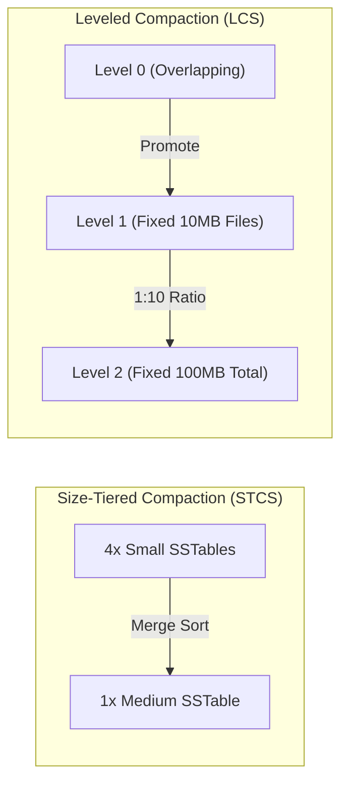

# LSM Trees & Compaction Strategies

Introduced by Patrick O'Neil et al. in 1996, the **Log-Structured Merge-Tree (LSM)** is the storage engine architecture powering **RocksDB**, **Apache Cassandra**, **ScyllaDB**, **CockroachDB (Pebble)**, and **Bigtable**. It transforms random writes into sequential disk operations.

---

## 1. The Core Lifecycle of a Write

```mermaid
graph TD
    Client["Client Write Request: PUT(k, v)"] --> WAL["1. Append to WAL (Disk Durability)"]
    Client --> Mem["2. Insert to MemTable (RAM SkipList)"]
    Mem -.->|When MemTable fills (e.g. 64MB)| Flush["3. Freeze & Flush as Immutable SSTable"]
    Flush --> L0["Level 0 (Disk: Overlapping Keys)"]
    L0 -->|Background Compaction| L1["Level 1 (Disk: Sorted, Non-overlapping)"]
    L1 -->|Multi-way Merge Sort| L2["Level 2 (10x Size of L1)"]
```

1. **Write-Ahead Log (WAL)**: The mutation is appended sequentially to disk. Because append operations require no seeks or page rewrites, the write commits in microseconds.
2. **MemTable**: Concurrently, the entry is inserted into a lock-free sorted in-memory data structure (a **SkipList**).
3. **Flushing**: Once the MemTable reaches a size threshold (e.g. 64MB - 256MB), it becomes an **Immutable MemTable** and a background thread flushes it to disk as a **Sorted String Table (SSTable)**.

---

## 2. Anatomy of an SSTable File

An SSTable is an immutable file structured for fast binary search and caching:

```
+-----------------------------------------------------------+
| Data Block 0 (4KB compressed key-values)                  |
| Data Block 1 (4KB compressed key-values)                  |
| Data Block N ...                                          |
+-----------------------------------------------------------+
| Filter Block (Bloom Filters for each Data Block)          |
+-----------------------------------------------------------+
| Index Block (Offset & Last Key of each Data Block)        |
+-----------------------------------------------------------+
| Meta Index Block                                          |
+-----------------------------------------------------------+
| Footer (Magic Number + Fixed Pointer to Index Block)      |
+-----------------------------------------------------------+
```

---

## 3. Bloom Filters: Zero False Negatives

To perform a point lookup (`GET key`), an LSM tree must inspect multiple SSTables across levels. Without optimization, this causes severe **Read Amplification**.

A **Bloom Filter** is a space-efficient probabilistic data structure stored in the SSTable header:
- If it reports **NO**: The key **definitely does not exist** in that SSTable. The disk read is skipped!
- If it reports **YES**: The key **probably exists** (with a tunable false positive rate $p$).

### Optimal Bit Allocation Formula

For $n$ keys and a desired false positive probability $p$:

$$m = -\frac{n \ln p}{(\ln 2)^2} \quad \text{and} \quad k = \frac{m}{n} \ln 2$$

For a standard **1% false positive rate ($p = 0.01$)**, an LSM engine requires only **$\approx 9.6\text{ bits per key}$** and $k = 7$ hash functions, filtering out 99% of unnecessary disk block reads!

---

## 4. Compaction Strategies

Because updates and deletes simply append new versions or **tombstones**, stale records accumulate on disk. **Compaction** is the background garbage collector that merges sorted runs and discards dead data.



### Leveled Compaction (LCS) vs Size-Tiered (STCS)

| Dimension | Leveled Compaction (LCS - RocksDB) | Size-Tiered (STCS - Cassandra) |
| :--- | :--- | :--- |
| **Write Amplification** | Higher ($10\times - 30\times$) | **Lower ($4\times - 8\times$)** |
| **Read Amplification** | **Lowest** (at most 1 file per level) | Higher (must check all SSTables in tier) |
| **Space Amplification** | **Lowest ($\approx 10\% - 20\%$ overhead)** | High (requires up to **100% free disk space**) |
| **Best Workload** | Read-heavy with mixed updates, predictable latency | High-throughput append-only time series |

:::tip Interactive Demonstration
Experience MemTable flushes, Bloom filters, and compaction live in our [LSM Tree Simulator](/docs/interactive/lsm-visualizer).
:::
